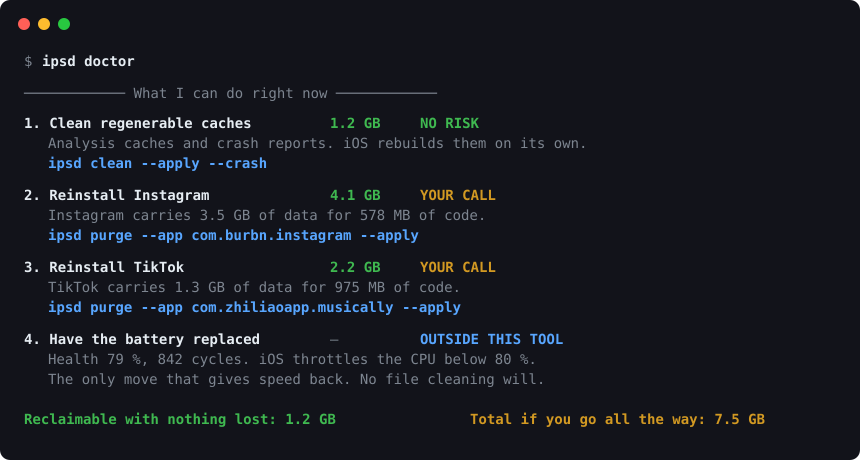

# iphone-storage-doctor

**Free up space on your iPhone from your Mac, and find out why an old iPhone
feels slow.** Plug in a USB cable — no jailbreak, no app on the phone, no
account, nothing leaves your machine.

[](https://github.com/tlegourrierec/iphone-storage-doctor/actions/workflows/ci.yml)
[](LICENSE)
[](pyproject.toml)

*[Version française](README.fr.md)*



## Clean it

`ipsd doctor` ends with a numbered plan: every action, what it reclaims, what
it costs you, and the exact command. Nothing is a guess — the sizes come from
the device itself.

```bash
ipsd plan                    # three levels, with what each one reclaims
ipsd clean --apply --crash   # delete regenerable caches (asks first)
ipsd boost --apply           # measure, clean, measure again
```

| Level | What it does | What it costs |
|---|---|---|
| **Simple** | Regenerable caches, crash reports | Nothing. iOS rebuilds them. |
| **Advanced** | + reinstall the three most cache-bloated apps | Sign in again on those apps |
| **Maximum** | + every re-downloadable app with no unique local data | Sign in again on each |

**Nothing is deleted without you saying yes**, every file is copied to the Mac
before it goes, and no level can touch your photos, iOS databases, or apps
holding data you cannot get back. Those exclusions are enforced by tests, not
by good intentions — see [Safety model](#safety-model).

On the devices this was built against, `ipsd clean` freed 270 MB on one phone
and 57 MB on another in seconds, and the plan surfaced 4–7 GB more sitting in
app caches.

## Then find out why it is slow

```console
$ ipsd battery
 Health        79.2 %   2230 / 2815 mAh
 Cycles        842      168 % of the 500 cycles Apple rates this model for
 Charge        64 %
 Temperature   31.4 °C

╭──────────────────────────────────────────────────────────────────────────╮
│ Worn battery. This is the number one cause of slowness on an older       │
│ device: iOS throttles the CPU to prevent shutdowns. Replacing the        │
│ battery buys back more performance than any amount of file cleaning.     │
╰──────────────────────────────────────────────────────────────────────────╯
```

## Why this exists

Every "iPhone cleaner" promises to make your phone fast again by deleting
files. That promise is false, and the tools that make it are guessing at
numbers they cannot measure. This project does three things differently.

**1. It answers the performance question honestly.** Health is computed from
the charge controller's own counters (`NominalChargeCapacity / DesignCapacity`),
without the rounding Settings applies, and cycle count is compared against the
rating for your specific model. No other storage tool reports this.

**2. It shows the gap instead of filling it with a guess.** Three iOS services
can be queried over USB. Together they do not account for the whole disk. The
difference is labelled *unattributed*, with the reason — rather than smeared
across a pie chart so it adds up to 100 %.

| Source | What it gives | Scope |
|---|---|---|
| `com.apple.disk_usage` | Capacity, used, free, purgeable | Whole disk |
| `installation_proxy` | Binary + data size, per app | Every app |
| `AFC` | File-by-file inventory | `/var/mobile/Media` only |
| — | **Everything else** | **Reported as unattributed** |

**3. It refuses to delete what it should not.** See [Safety model](#safety-model).

## What it cannot do (verified, not assumed)

Honesty about limits is the point of this project, so these were tested by
direct calls against a real device rather than inferred:

| Attempt | Result |
|---|---|
| Read an App Store app's cache container (`house_arrest`) | **Refused** — `InstallationLookupFailed` |
| Read storage keys via `mobilegestalt` | **Refused** — `DeprecationError` (closed since iOS 17) |
| Decompose the "purgeable" figure | **Impossible** — `NANDInfo` is flash-controller telemetry, not a breakdown |

So: **no Mac-side tool can clear Instagram's cache.** That is the iOS sandbox,
not a missing feature. What this tool does instead is *measure* those caches
and tell you the only action that actually frees them — uninstalling the app,
which it can drive for you, with guardrails.

## Install

### Recommended: the install script

```bash
git clone https://github.com/tlegourrierec/iphone-storage-doctor
cd iphone-storage-doctor && ./install.sh
```

It checks that the Python it will use is 3.11 or newer — macOS still ships 3.9,
which is the most common reason a plain `pip3 install` fails.

### Homebrew

```bash
brew tap tlegourrierec/tap
brew install iphone-storage-doctor
```

Homebrew builds this from source, which requires up-to-date Command Line
Tools. If `brew install` stops on *"Your Command Line Tools are too outdated"*,
either update them from Software Update or use the install script above — it
does not need a compiler.

### pipx

```bash
pipx install git+https://github.com/tlegourrierec/iphone-storage-doctor
```

Plug in the iPhone, unlock it, tap **Trust This Computer**, then run `ipsd doctor`.

### Language

The first run asks which language you want, and remembers it:

```
Choose your language / Choisis ta langue
  1. English
  2. Français
```

Change it any time with `ipsd lang fr`, override it for one run with
`--lang en`, or set `IPSD_LANG` in your environment. Without a terminal to ask
in, the tool follows your system locale and falls back to English.

## Commands

| Command | What it does |
|---|---|
| `ipsd doctor` | Full diagnosis: storage breakdown, battery, findings |
| `ipsd battery` | Real battery health and throttling verdict |
| `ipsd storage` | Counters only, instant |
| `ipsd apps` | Every app ranked by space, binary vs data |
| `ipsd plan` | Three cleaning levels, with what each one reclaims |
| `ipsd purgeable` | What iOS calls "purgeable", and why not to chase it |
| `ipsd clean` | Delete files classified SAFE (dry run by default) |
| `ipsd purge` | Uninstall apps to reclaim their cache, with guardrails |
| `ipsd trend` | What grew since the last snapshot |
| `ipsd restart` | Reboot the device |
| `ipsd lang` | Show or change the interface language |

Every command takes `--json`.

## Safety model

### Three levels, each with its price named

`ipsd plan` shows what each level reclaims before you commit to any of it:

| Level | What it does | What it costs |
|---|---|---|
| **Simple** | Regenerable caches, crash reports | Nothing. iOS rebuilds them. |
| **Advanced** | + reinstall the three most cache-bloated apps | Sign in again on those apps |
| **Maximum** | + every re-downloadable app with no unique local data | Sign in again on each |

No level touches photos, iOS databases, or apps holding irreplaceable data.
Those exclusions are structural, not options — a test asserts that even the
maximum level leaves them alone.

### Nothing is deleted without you saying yes

`--apply` is not consent. Before removing anything from the device, the tool
prints exactly what it found — how many files, how much space, which category —
and waits for a yes. Outside an interactive terminal it refuses to proceed
rather than assume agreement; `--yes` is available for scripts and CI, and has
to be typed deliberately.

Findings carry one of three levels, and the tool only ever deletes the first:

- **SAFE** — cache iOS regenerates. Deleted by `ipsd clean --apply`, after
  being copied to the Mac first.
- **REVIEW** — reclaimable, but it is your call. Offline music, podcasts,
  large apps. Never touched automatically.
- **MANUAL** — never touched. User data, or a deletion that would corrupt an
  iOS database.

### The rule with no exception

**Nothing under `/DCIM` or `/PhotoData` is ever deletable by this tool.**

Deleting a photo over AFC removes the file but leaves its row in
`Photos.sqlite`: inconsistent library, ghost thumbnails, iCloud sync drift.
Photos are deleted from the Photos app. A unit test enforces this, and it
would fail if someone changed the behaviour.

### Uninstall guardrails

`ipsd purge` is the only way to reclaim an app's cache, and it destroys that
app's local data. The tool recognises the categories where that loss is
unrecoverable and **excludes them by default**, showing the reason:

- two-factor authenticator apps — you can lock yourself out of your accounts
- messengers with local history
- crypto wallets holding local keys
- photo editors with unsynced projects
- note-taking apps

`--force-risky` overrides this, deliberately. `--apply` additionally requires
typing a confirmation word, and free space is measured before and after so you
see the real gain rather than the estimate.

## Performance: what is true

Freeing space speeds up an iPhone in exactly one case: below roughly 10 % free,
APFS runs out of room to work and everything slows down. Above that, going from
30 GB free to 50 GB free changes nothing.

On an older device the real factor is the battery. Once health drops below
80 %, iOS caps peak CPU frequency to avoid unexpected shutdowns. That is why
`ipsd battery` exists, and why this project will not sell you a speed-up in
exchange for deleting files.


## Troubleshooting

| Symptom | Cause and fix |
|---|---|
| `requires a different Python: 3.9.x not in '>=3.11'` | macOS ships Python 3.9. Use `./install.sh` or pipx, which bring their own interpreter — not `pip3 install`. |
| `command not found: ipsd` | pipx installed it outside your PATH. Run `pipx ensurepath`, then open a new terminal. |
| `No iPhone detected` while it is plugged in | Unlock the screen. The pairing prompt only appears on an unlocked device, and it times out. |
| `iPhone detected but not paired` | Tap **Trust This Computer** on the phone, then enter its passcode. |
| Still "not paired" after tapping Trust, or the dialog never appears | The device remembers a previous refusal. Unplug and replug while unlocked. If that fails: **Settings › General › Transfer or Reset iPhone › Reset › Reset Location & Privacy**, then replug. That clears the list of refused computers and nothing else. |
| `The USB link dropped mid-operation` | Most often a second `ipsd` running at the same time: usbmuxd does not handle concurrent sessions on one device. Wait for the first to finish. Otherwise keep the phone unlocked and plug it straight into the Mac, not through a hub. |
| The tool stops mid-run | The cable came loose. Nothing is left half-deleted: quarantined files are copied before removal. Plug back in and re-run. |
| Output is in the wrong language | `ipsd lang en` or `ipsd lang fr`. |
| `brew install` says Command Line Tools are too outdated | Homebrew builds from source and needs current CLT: `sudo rm -rf /Library/Developer/CommandLineTools && sudo xcode-select --install`. Or use `./install.sh`, which needs no compiler. |

Note: `ipsd doctor` walks tens of thousands of files over USB and takes two to
three minutes. `--profile fast` cuts that to about thirty seconds with a
coarser inventory.

## Requirements

macOS, Python 3.11+, an iPhone connected over USB and paired. No developer
mode required. Built on [pymobiledevice3](https://github.com/doronz88/pymobiledevice3).

## Contributing

See [CONTRIBUTING.md](CONTRIBUTING.md). Device compatibility reports are real
contributions — iOS changes which services answer between releases.

## License

MIT
